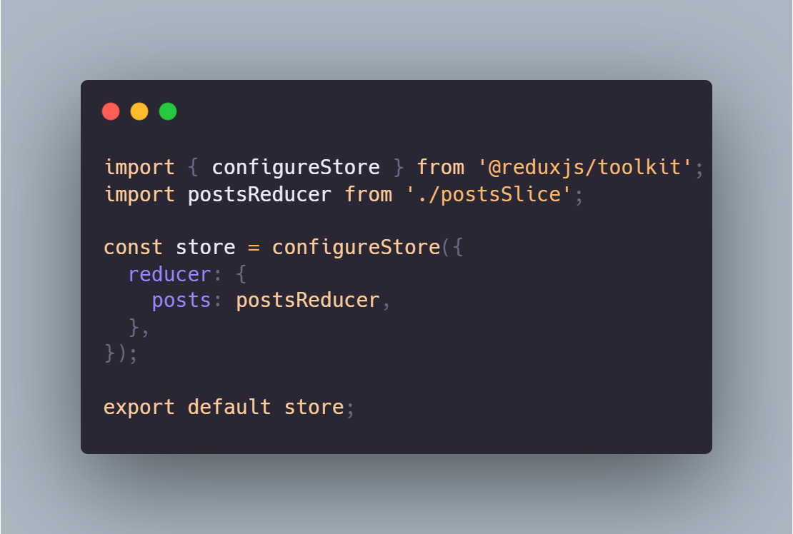

<<<<<<< HEAD
# **Task 3**
##  
# **Installation Instructions**
1. git clone git@github.com:DevilAngel123/BlueOCTest.git
2. cd BlueOCTest
3. npm install

# **Solution to the task**

- ### Step 1 : Setting up the project
    1. `npx create-react-app my-app`
    2. `cd my-app`
- ### Step 2 : Install Redux toolkit and react-Redux
    - `npm install @reduxjs/toolkit react-redux axios`
- ### Step 3 : Create Redux store folder
    1. Use `mkdir redux` to create redux folder.
    2. `cd redux` to enter folder.
    2. create new file `store.js`:

        
    - Using Redux new toolkit configureStore function to store
        `import { configureStore } from '@reduxjs/toolkit';`
    - Use `postsReducer` to manage state of `posts`.
    3. create new file "postSlices.js":
    .png>)

    - Using `fetchPosts` to fetch posts from the API address `(jsonplaceholder.typicode.com)` to return data.
    - Using `aNewPost` to send a new post to the API and return addded data.

- ### Step 4 : Components folder
    1. Use `mkdir components` to create components folder.
    2. `cd components` to enter components folder.
    3. Create `PostForm.js` file:
    .png>)
    - Use `useState` to manage the form fields `title` and `body`.
    - Use `useDispatch` to send the new post data to Redux by dispatching the `addNewPost` action.
    - if both fields are filled, creates a `newPost` object, dispatches it, and clears the form fields.
    4. Create `PostList.js` file:
        .png>)

        - Use `useSelector` to access `posts`, `loading`, and `error` from the Redux store to post the current state.
        - Use `useDispatch` to trigger the `fetchPosts` action when the component first renders.
        - Fetches data from the API and displays them.
- ### Step 5 : Modification
    - Modify the `index.js` file:
        .png>)
        - Using `Provider` as a warp to warp the component `App` for Redux `store` and `root` render all the components.
    - Modify the `App.js` file:
        .png>)
        - Display the header with "Post List".
        - Includes the `PostForm` component to add new posts.
        - Shows the `PostsList` component to display the list of posts.

- ### Step 6 : Run
    - Use `npm star` to start the application.
    
